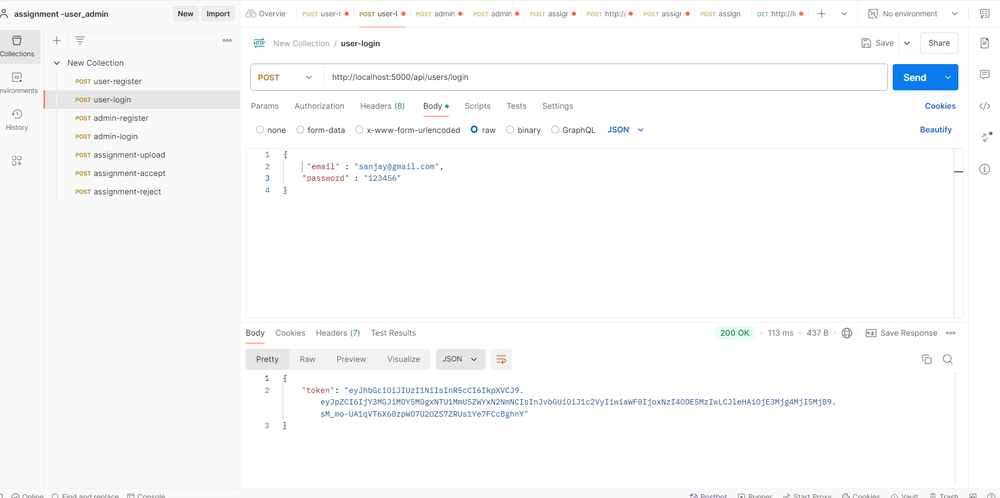
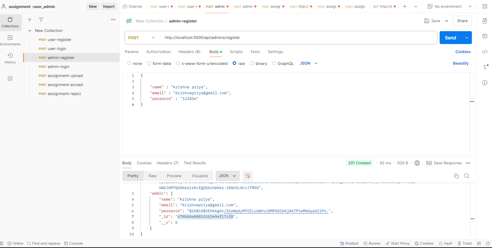
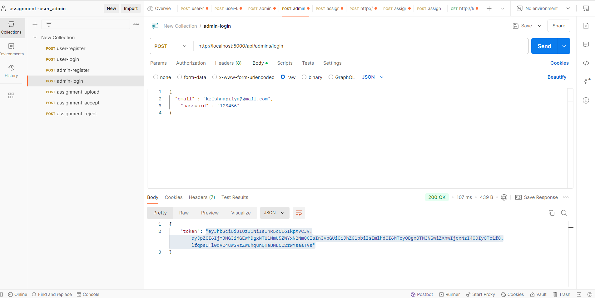
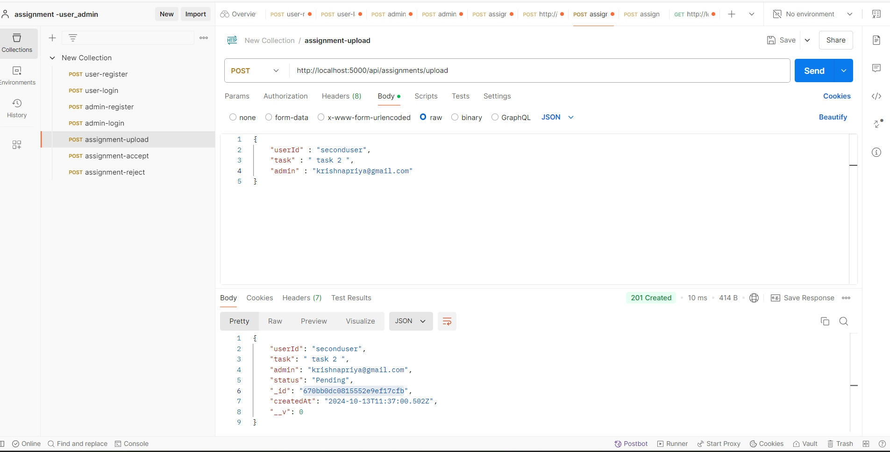
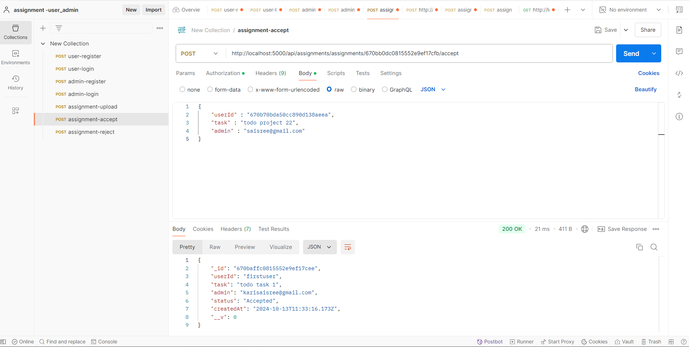
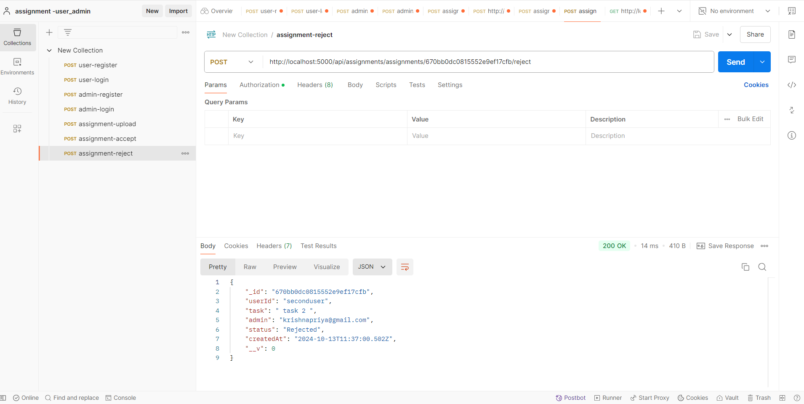

# UserAssignment_Admin_Acceptance

## Project Description

The **UserAssignment_Admin_Acceptance** project is a task management system that allows users and admins to log in and out. Users can create tasks by tagging an admin, while admins have the ability to accept or reject those tasks. The project is built using Node.js, Express.js, and MongoDB, with Postman utilized for testing API endpoints.

## Features

- **User Authentication**: Users and admins can log in and log out securely.
- **Task Creation**: Users can create tasks and tag an admin for assignment.
- **Admin Actions**: Admins can view the tasks they are tagged in and either accept or reject tasks.
- **Duplicate Email Prevention**: The system prevents users from registering with duplicate email addresses.
- **Protected Endpoints**: The task acceptance and rejection endpoints are protected with authorization, ensuring that only authenticated admins can perform these actions.

## Technologies Used

- **Node.js**: Backend runtime environment
- **Express.js**: Web framework for Node.js
- **MongoDB**: NoSQL database for storing user and task information
- **Postman**: API testing tool

## Installation and Setup

1. **Clone the repository** from GitHub:
   ```bash
   git clone https://github.com/sanju0911/UserAssignment_Admin_Acceptance.git 
2. **install the dependencies**
   ```bash
   npm install
   npm start


## API Endpoints

### User Endpoints

  ```http
  POST localhost:5000/api/users/register
  POST localhost:5000/api/users/login

### admin Endpoints
  
  ```http
  POST localhost:5000/api/admins/register
  POST localhost:5000/api/admins/login

### assignment Endpoints

    ```http
  POST localhost:5000/api/assignments/assignments/id/accept
   POST localhost:5000/api/assignments/assignments/id/reject


#######    OUTPUT SCREENS - POSTMAN  ##########

# USER REGISTER 
c:\Users\Sanju\Desktop\user-register.png
# USER LOGIN

# ADMIN REGISTER

# ADMIN LOGIN

# ASSIGNMENT UPLOAD

# ASSIGNMENT ACCEPT

# ASSIGNMENT REJECT
